# Gemma 4 架构深度解析：31B Dense vs 26B-A4B MoE

> 本文详细对比 Google Gemma 4 两款中大型模型的架构设计，帮助理解稠密模型与混合专家模型的核心差异。

---

## 目录

1. [模型概览](#1-模型概览)
2. [共享基础架构](#2-共享基础架构)
3. [Dense 31B 架构详解](#3-dense-31b-架构详解)
4. [MoE 26B-A4B 架构详解](#4-moe-26b-a4b-架构详解)
5. [核心差异：FFN vs MoE Layer](#5-核心差异ffn-vs-moe-layer)
6. [Router 路由机制](#6-router-路由机制)
7. [注意力机制](#7-注意力机制)
8. [Per-Layer Embedding (PLE)](#8-per-layer-embedding-ple)
9. [视觉编码器](#9-视觉编码器)
10. [性能与效率对比](#10-性能与效率对比)
11. [微调注意事项](#11-微调注意事项)

---

## 1. 模型概览

| 特性 | Gemma 4 31B (Dense) | Gemma 4 26B-A4B (MoE) |
|:---|:---|:---|
| 架构类型 | 稠密 Transformer | 混合专家 (Mixture of Experts) |
| 总参数量 | 30.7B | 25.2B |
| **激活参数量** | **30.7B (100%)** | **3.8B (15%)** |
| 层数 | 60 | 30 |
| 隐藏维度 | 4096 | 5376 |
| 注意力头数 | 32 | 42 |
| KV 头数 | 16 | 6 |
| 上下文长度 | 256K | 256K |
| 词表大小 | 262,144 | 262,144 |
| 视觉编码器 | SigLIP2 (~550M) | SigLIP2 (~550M) |
| 许可协议 | Apache 2.0 | Apache 2.0 |

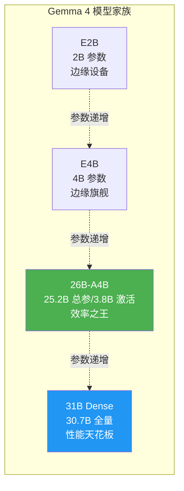

---

## 2. 共享基础架构

两个模型共享同一套基础设计，差异仅在 FFN 层的处理方式上。

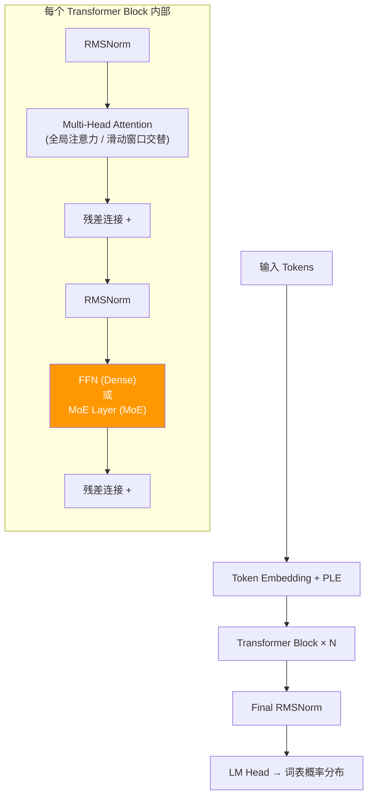

### 共享技术栈

| 技术 | 说明 |
|:---|:---|
| **RoPE** | 旋转位置编码，支持长序列外推 |
| **RMSNorm** | 比 LayerNorm 更高效的归一化，省去均值计算 |
| **GeGLU** | FFN 激活函数，= GELU(xW₁) ⊙ (xW₂)，比 ReLU 效果更好 |
| **滑动窗口注意力** | 窗口大小 1024，与全局注意力交替使用，降低长序列计算量 |
| **GQA** | 分组查询注意力，多个 Q 头共享一组 KV 头，节省 KV Cache |

---

## 3. Dense 31B 架构详解

Dense（稠密）模型的核心特点：**每个 token 经过每一层时，所有参数都参与计算，没有跳过、没有选择。**

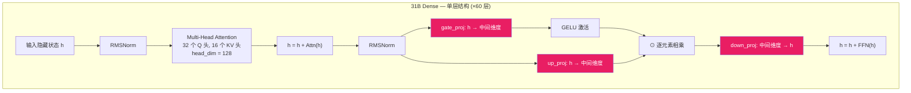

### 数据流动（以单个 token 为例）

```
Token "你好"
  │
  ▼ Embedding: 映射到 4096 维向量
  │
  ▼ Layer 1:  Attention(全局) → FFN(全部 30.7B 参数参与)
  ▼ Layer 2:  Attention(滑动窗口) → FFN(全部参数参与)
  ▼ Layer 3:  Attention(全局) → FFN(全部参数参与)
  │  ...
  ▼ Layer 60: Attention → FFN
  │
  ▼ LM Head: 4096 维 → 262144 维 (词表概率)
  │
  ▼ 输出: 下一个 token 的概率分布
```

**关键数字**：
- 每个 token 要经过 **60 层**，每层都做完整的注意力 + FFN 计算
- FFN 中间维度约为隐藏维度的 4 倍 ≈ 16384
- 单次前向传播的 FLOPs ≈ **2 × 30.7B ≈ 61.4 GFLOPs/token**

---

## 4. MoE 26B-A4B 架构详解

MoE 模型的核心特点：**FFN 层被拆成多个"专家"，每个 token 只激活其中少数几个专家。**

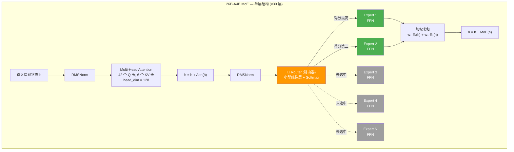

### 类比理解

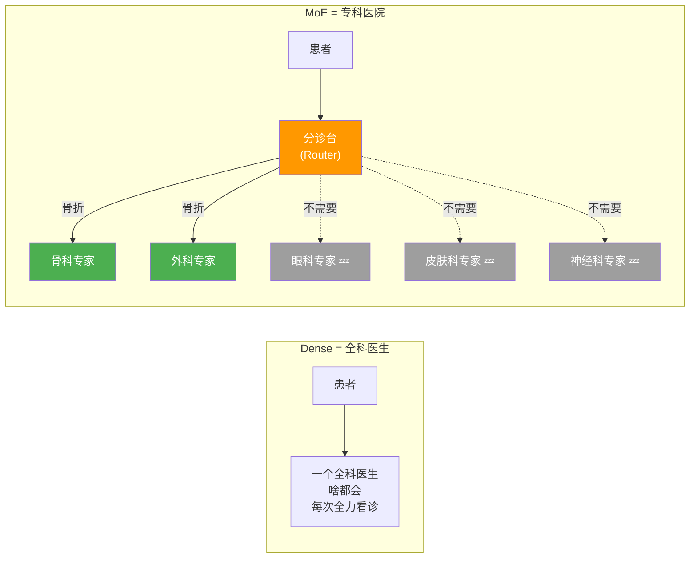

**关键数字**：
- 只有 **30 层**（Dense 的一半），用更宽的层来补偿深度
- 每层有多个专家 FFN，每个 token 只激活 **Top-K** 个
- 总参数 25.2B，但每次推理只计算 **3.8B**
- 单次前向传播的 FLOPs ≈ **2 × 3.8B ≈ 7.6 GFLOPs/token**（是 Dense 的 1/8）

---

## 5. 核心差异：FFN vs MoE Layer

这是两个模型**唯一的结构性差异**——注意力层完全一样，区别只在 FFN 层。

### Dense FFN（31B 使用）

```
输入 h (4096 维)
    │
    ├──→ gate_proj (4096 → ~16384) ──→ GELU ──┐
    │                                          ⊙ 逐元素相乘
    └──→ up_proj   (4096 → ~16384) ───────────┘
                                    │
                              down_proj (~16384 → 4096)
                                    │
                              输出 h' (4096 维)
```

- **每个 token 都走同一个 FFN**
- 参数量 = 3 × 4096 × 16384 ≈ **201M / 层**
- 60 层 FFN 总参数 ≈ **12B**

### MoE Layer（26B-A4B 使用）

```
输入 h (5376 维)
    │
    ▼
Router: h × W_router (5376 → N_experts) → Softmax
    │
    ▼ 选出 Top-K 个专家及其权重 w_k
    │
    ├──→ Expert_i: 和 Dense FFN 结构完全一样
    │    gate_proj → GELU → ⊙ up_proj → down_proj
    │    输出: e_i
    │
    ├──→ Expert_j: 同上
    │    输出: e_j
    │
    ▼
输出 h' = w_i · e_i + w_j · e_j  (加权求和)
```

- **每个 token 只走被选中的 K 个专家**
- 单个专家参数量远小于 Dense FFN
- 但专家总数 × 单个专家参数 ≈ 总 FFN 参数量很大（存储了更多知识）

### 对比图

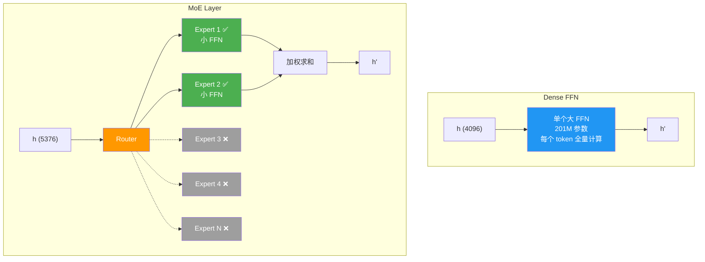

---

## 6. Router 路由机制

Router 是 MoE 架构的"大脑"，决定每个 token 该由哪些专家处理。

### 工作流程

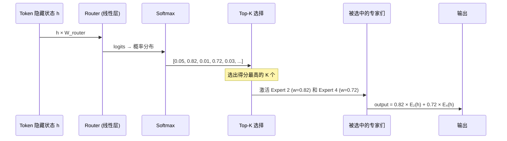

### 负载均衡问题

MoE 训练中有一个经典难题：**专家坍塌（Expert Collapse）**

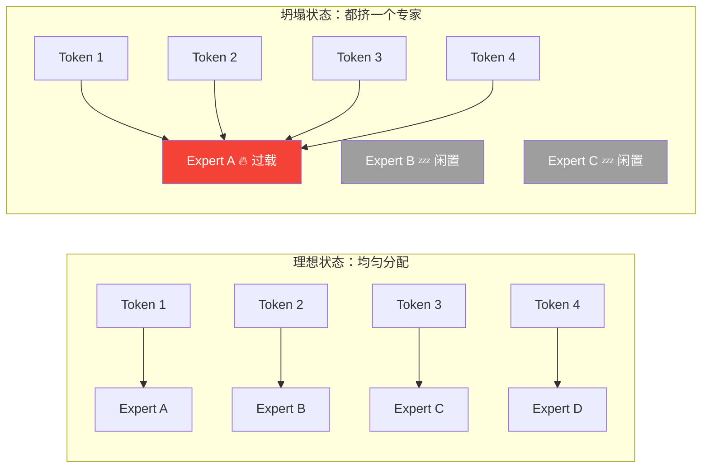

**解决方案**：训练时加入 **辅助损失函数（Auxiliary Loss）**，惩罚负载不均衡的情况，强制 Router 把 token 分散到不同专家。

### Router 学到了什么？

训练完成后，不同专家会自然地"专精"不同类型的知识：

| 专家 | 可能擅长的领域（示意） |
|:---|:---|
| Expert 1 | 数学运算、逻辑推理 |
| Expert 2 | 自然语言理解、语义分析 |
| Expert 3 | 代码生成、编程语法 |
| Expert 4 | 多语言翻译、跨语言对齐 |
| Expert 5 | 事实性知识、百科问答 |
| ... | ... |

> ⚠️ 注意：这种"专精"是自发涌现的，不是人为指定的。实际中每个专家的功能边界是模糊的。

---

## 7. 注意力机制

两个模型都使用**全局注意力与滑动窗口注意力交替**的策略，但具体配置不同。

### 注意力类型交替

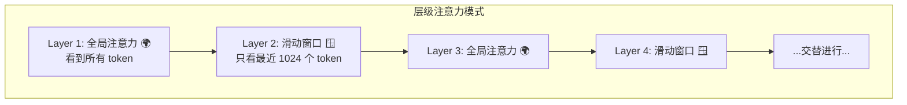

### 为什么要交替？

| 注意力类型 | 计算复杂度 | 能力 |
|:---|:---|:---|
| 全局注意力 | O(n²)，n 为序列长度 | 能捕捉任意距离的依赖关系 |
| 滑动窗口 | O(n × w)，w=1024 | 只关注局部上下文，计算量小 |

交替使用 = **用局部注意力处理大部分"就近参考"的场景，用全局注意力处理需要"远距离回忆"的场景**。

### GQA（分组查询注意力）

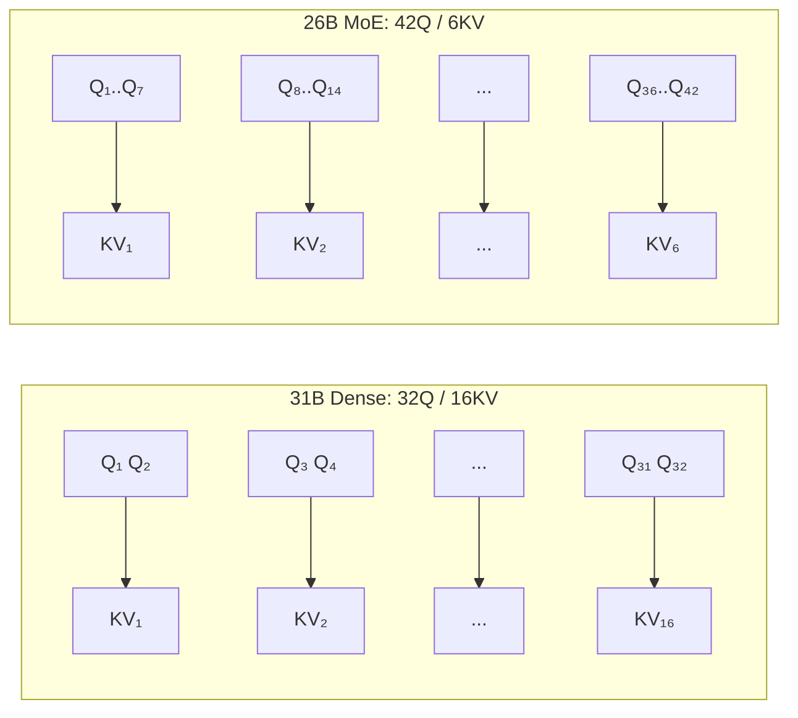

| | 31B Dense | 26B-A4B MoE |
|:---|:---|:---|
| Q 头数 | 32 | 42 |
| KV 头数 | 16 | 6 |
| Q/KV 比 | 2:1 | 7:1 |
| KV Cache 大小 | 较大 | **更小（KV 头更少）** |

MoE 版本用了更激进的 GQA 比例（7:1），进一步压缩了 KV Cache 的显存占用。

---

## 8. Per-Layer Embedding (PLE)

PLE（Per-Layer Embedding）是 Gemma 4 引入的新技术，提升参数效率。

### 传统方式 vs PLE

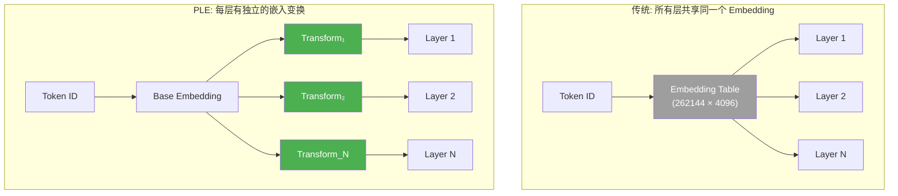

### 为什么 PLE 有效？

传统方式中，浅层和深层看到的是完全相同的输入表示。但实际上：
- **浅层**需要更多的表面特征（词形、语法）
- **深层**需要更多的语义特征（含义、逻辑）

PLE 让每一层都能对输入做一个轻量级的变换，使得不同深度的层看到"适合自己的"输入表示，提升了参数利用效率。

---

## 9. 视觉编码器

两个模型共享同一个视觉编码器 **SigLIP2**，约 550M 参数。

### 多模态处理流程

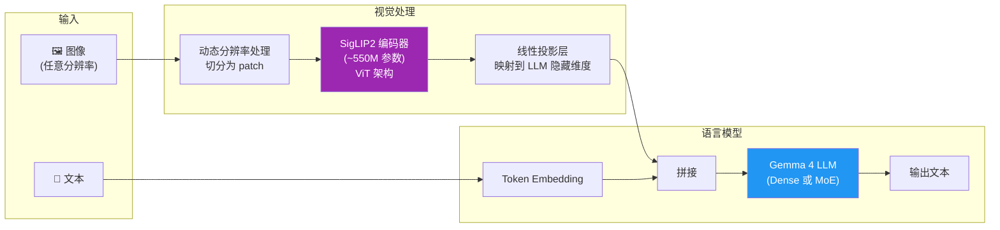

### 关键设计

| 特性 | 说明 |
|:---|:---|
| 可变分辨率 | 不强制缩放到固定尺寸，保留原始细节 |
| Pan & Scan | 智能裁剪策略，关注图像重要区域 |
| 软 Token 上限 | 控制视觉 token 数量，避免占用过多上下文 |
| 视频支持 | 将视频帧序列作为多张图像输入 |

---

## 10. 性能与效率对比

<!-- PLACEHOLDER: performance -->

---

## 11. 微调注意事项

<!-- PLACEHOLDER: finetune -->
