# Gemma 4 架构深度解析：31B Dense vs 26B-A4B MoE

> 本文详细对比 Google Gemma 4 两款中大型模型的架构设计，帮助理解稠密模型与混合专家模型的核心差异。

---

## 目录

1. [模型概览](#1-模型概览)
2. [共享基础架构](#2-共享基础架构)
3. [Dense 31B 架构详解](#3-dense-31b-架构详解)
4. [MoE 26B-A4B 架构详解](#4-moe-26b-a4b-架构详解)
5. [核心差异：FFN vs MoE Layer](#5-核心差异ffn-vs-moe-layer)
6. [Router 路由机制](#6-router-路由机制)
7. [注意力机制](#7-注意力机制)
8. [Per-Layer Embedding (PLE)](#8-per-layer-embedding-ple)
9. [视觉编码器](#9-视觉编码器)
10. [性能与效率对比](#10-性能与效率对比)
11. [微调注意事项](#11-微调注意事项)

---

## 1. 模型概览

| 特性 | Gemma 4 31B (Dense) | Gemma 4 26B-A4B (MoE) |
|:---|:---|:---|
| 架构类型 | 稠密 Transformer | 混合专家 (Mixture of Experts) |
| 总参数量 | 30.7B | 25.2B |
| **激活参数量** | **30.7B (100%)** | **3.8B (15%)** |
| 层数 | 60 | 30 |
| 隐藏维度 | 4096 | 2816 |
| 注意力 Q 头数 | 32 | 16 |
| KV 头数 | 16 | 8 |
| Head 维度 | 128 | 256 |
| 专家数 / 激活数 | — | 128 / Top-8 |
| 单个专家参数 | — | ~6M |
| MoE 中间维度 | — | 704 |
| 上下文长度 | 256K | 256K |
| 词表大小 | 262,144 | 262,144 |
| 视觉编码器 | SigLIP2 (~550M) | SigLIP2 (~550M) |
| 许可协议 | Apache 2.0 | Apache 2.0 |

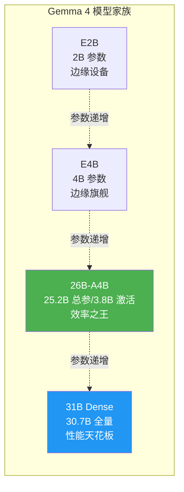

---

## 2. 共享基础架构

两个模型共享同一套基础设计，差异仅在 FFN 层的处理方式上。

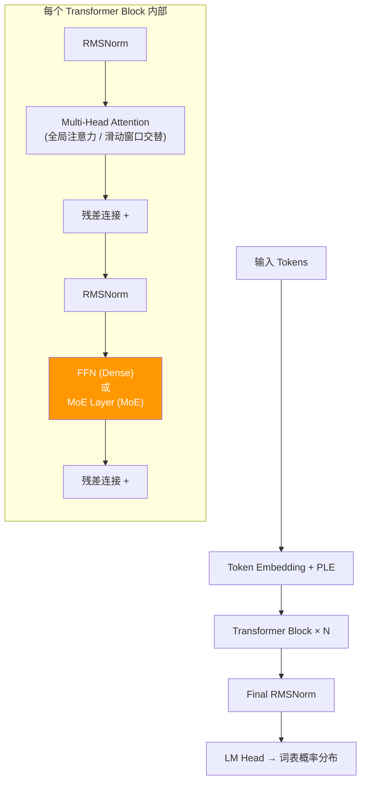

### 共享技术栈

| 技术 | 说明 |
|:---|:---|
| **RoPE** | 旋转位置编码，支持长序列外推 |
| **RMSNorm** | 比 LayerNorm 更高效的归一化，省去均值计算 |
| **GeGLU** | FFN 激活函数，= GELU(xW₁) ⊙ (xW₂)，比 ReLU 效果更好 |
| **滑动窗口注意力** | 窗口大小 1024，与全局注意力交替使用，降低长序列计算量 |
| **GQA** | 分组查询注意力，多个 Q 头共享一组 KV 头，节省 KV Cache |

---

## 3. Dense 31B 架构详解

Dense（稠密）模型的核心特点：**每个 token 经过每一层时，所有参数都参与计算，没有跳过、没有选择。**

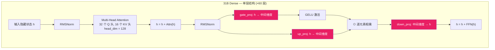

### 数据流动（以单个 token 为例）

```
Token "你好"
  │
  ▼ Embedding: 映射到 4096 维向量
  │
  ▼ Layer 1:  Attention(全局) → FFN(全部 30.7B 参数参与)
  ▼ Layer 2:  Attention(滑动窗口) → FFN(全部参数参与)
  ▼ Layer 3:  Attention(全局) → FFN(全部参数参与)
  │  ...
  ▼ Layer 60: Attention → FFN
  │
  ▼ LM Head: 4096 维 → 262144 维 (词表概率)
  │
  ▼ 输出: 下一个 token 的概率分布
```

**关键数字**：
- 每个 token 要经过 **60 层**，每层都做完整的注意力 + FFN 计算
- FFN 中间维度约为隐藏维度的 4 倍 ≈ 16384
- 单次前向传播的 FLOPs ≈ **2 × 30.7B ≈ 61.4 GFLOPs/token**

---

## 4. MoE 26B-A4B 架构详解

MoE 模型的核心特点：**FFN 层被拆成多个"专家"，每个 token 只激活其中少数几个专家。**

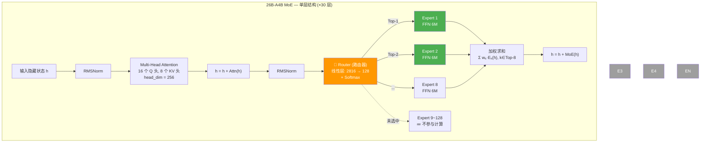

### 类比理解

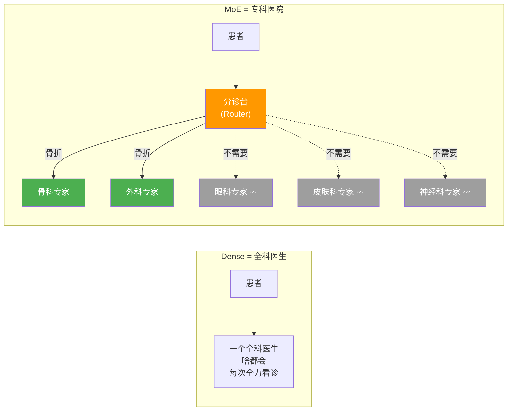

### 具体配置（来自 config.json）

| 参数 | 值 | 含义 |
|:---|:---|:---|
| `num_experts` | **128** | 每层有 128 个专家 |
| `top_k_experts` | **8** | 每个 token 只激活 8 个（6.25%） |
| `hidden_size` | 2816 | 隐藏维度 |
| `moe_intermediate_size` | 704 | 每个专家 FFN 的中间维度 |
| `num_attention_heads` | 16 | Q 头数 |
| `num_key_value_heads` | 8 | KV 头数 |
| `head_dim` | 256 | 每个注意力头的维度 |

### 单个专家的结构

每个专家就是一个微型 GeGLU FFN：

```
输入 h (2816 维)
    │
    ├──→ gate_proj (2816 → 704) ──→ GELU ──┐
    │                                       ⊙ 逐元素相乘
    └──→ up_proj   (2816 → 704) ──────────┘
                                 │
                           down_proj (704 → 2816)
                                 │
                           输出 (2816 维)

单个专家参数 = 3 × 2816 × 704 ≈ 5.95M（约 600 万参数）
```

### 每层的参数分布

```
每层专家总参数 = 128 × 5.95M ≈ 761M
每层激活参数   = 8 × 5.95M   ≈ 48M  ← 实际计算量
激活比例 = 48M / 761M = 6.25%
```

### 30 层的注意力类型分布

```
Layer  1-5:  滑动窗口 × 5  ┐
Layer  6:    全局注意力     ├─ 每 6 层一个周期
Layer  7-11: 滑动窗口 × 5  ┤
Layer 12:    全局注意力     ├─ 5:1 的比例
Layer 13-17: 滑动窗口 × 5  ┤  滑动窗口:全局 = 25:5
Layer 18:    全局注意力     ┤
Layer 19-23: 滑动窗口 × 5  ┤
Layer 24:    全局注意力     ┤
Layer 25-29: 滑动窗口 × 5  ┤
Layer 30:    全局注意力     ┘
```

> 30 层中只有 **5 层全局注意力**，其余 25 层都是滑动窗口（只看最近 1024 token）。这也解释了为什么 MoE 在 128K 长上下文检索任务上比 Dense（60 层更多全局注意力）差距较大。

**关键数字**：
- 只有 **30 层**（Dense 的一半），用更宽的层（128 专家）来补偿深度
- 每层 **128 个专家**，每个 token 只激活 **Top-8**（6.25%）
- 单个专家仅 **~6M 参数**，极致细粒度分工（对比 Mixtral 8x7B 只有 8 个大专家）
- 总参数 25.2B，但每次推理只计算 **3.8B**
- 单次前向传播的 FLOPs ≈ **2 × 3.8B ≈ 7.6 GFLOPs/token**（是 Dense 的 1/8）

---

## 5. 核心差异：FFN vs MoE Layer

这是两个模型**唯一的结构性差异**——注意力层完全一样，区别只在 FFN 层。

### Dense FFN（31B 使用）

```
输入 h (4096 维)
    │
    ├──→ gate_proj (4096 → ~16384) ──→ GELU ──┐
    │                                          ⊙ 逐元素相乘
    └──→ up_proj   (4096 → ~16384) ───────────┘
                                    │
                              down_proj (~16384 → 4096)
                                    │
                              输出 h' (4096 维)
```

- **每个 token 都走同一个 FFN**
- 参数量 = 3 × 4096 × 16384 ≈ **201M / 层**
- 60 层 FFN 总参数 ≈ **12B**

### MoE Layer（26B-A4B 使用）

```
输入 h (5376 维)
    │
    ▼
Router: h × W_router (5376 → N_experts) → Softmax
    │
    ▼ 选出 Top-K 个专家及其权重 w_k
    │
    ├──→ Expert_i: 和 Dense FFN 结构完全一样
    │    gate_proj → GELU → ⊙ up_proj → down_proj
    │    输出: e_i
    │
    ├──→ Expert_j: 同上
    │    输出: e_j
    │
    ▼
输出 h' = w_i · e_i + w_j · e_j  (加权求和)
```

- **每个 token 只走被选中的 K 个专家**
- 单个专家参数量远小于 Dense FFN
- 但专家总数 × 单个专家参数 ≈ 总 FFN 参数量很大（存储了更多知识）

### 对比图

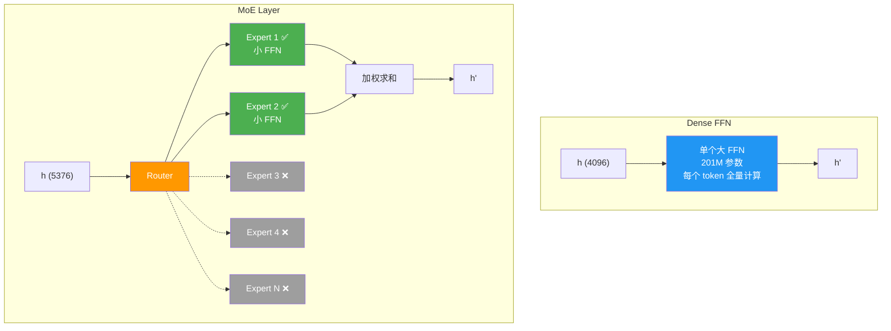

---

## 6. Router 路由机制

Router 是 MoE 架构的"大脑"，决定每个 token 该由哪些专家处理。

### 工作流程

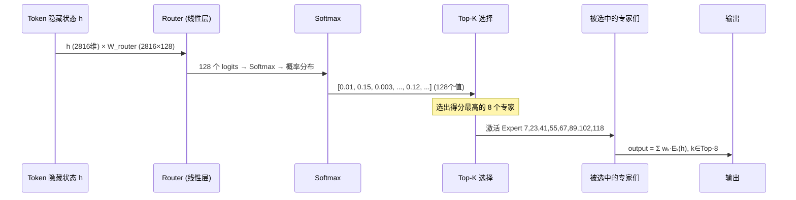

### 负载均衡问题

MoE 训练中有一个经典难题：**专家坍塌（Expert Collapse）**

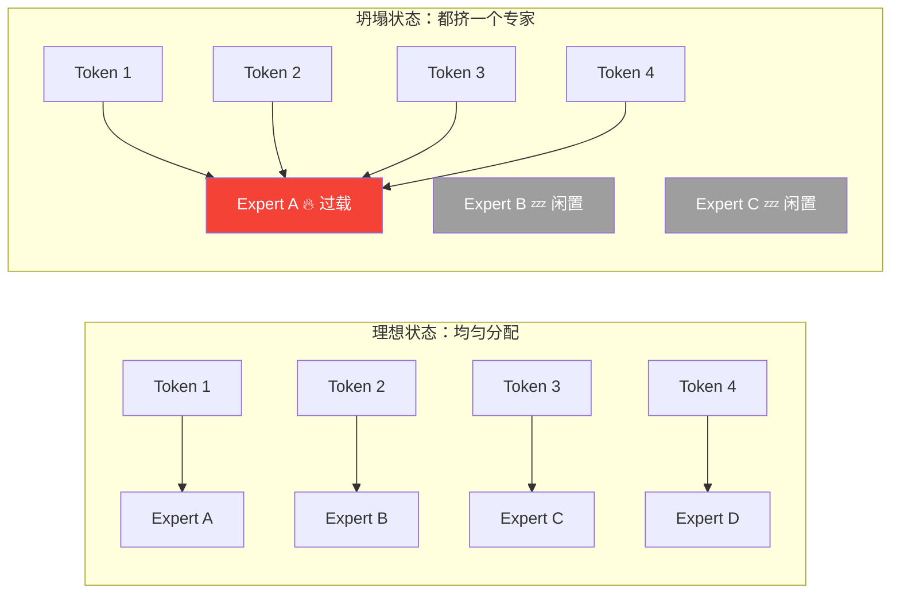

**解决方案**：训练时加入 **辅助损失函数（Auxiliary Loss）**，惩罚负载不均衡的情况，强制 Router 把 token 分散到不同专家。

### 「有哪些专家模型」——官方没有名单

- Google **没有**为 128 个专家起名字，也**没有**公开「Expert 37 = 代码、Expert 52 = 中文」这类映射。
- 在实现上只有 **Expert 0 ~ Expert 127**：每个都是**同构**的小 FFN（2816→704→2816），权重不同而已。
- 训练后 Router 会学到某种**隐式分工**（有的专家在某些层、某些 token 上更常被选中），但这是**涌现现象**，边界模糊，不能当成严格的「业务模块」。

### 如何自己看「谁在干活」

可以用 Hook 读取每层 `Gemma4TextRouter` 的输出第三项 `top_k_index`，统计不同输入下哪些 **ID** 出现得多。

项目里脚本：`analyze_experts.py`（需将 `text_config._experts_implementation` 设为 `"eager"`，否则在部分 GPU 上 `grouped_mm` 会报错）。

下面是一次示例运行（**仅供参考**：同一段话换措辞、换 tokenizer 长度，排序会变；**不能**据此给专家贴永久标签）：

| 测试场景 | 出现较多的专家 ID（Top 若干，计数） |
|:---|:---|
| 中文 | 52, 37, 42, 49, 124, 97, 92, 6, … |
| 英文 | 56, 102, 42, 37, 64, 120, 53, … |
| 数学式 | 102, 74, 28, 20, 16, 33, 111, … |
| Python 代码 | 37, 111, 74, 40, 54, 75, 102, … |
| 日语 | 37, 0, 111, 113, 56, 85, 106, … |
| JSON + 中文 | 37, 48, 120, 117, 0, 106, 43, … |

可见 **37、102、28、56** 等在多类输入里都会反复出现——更像「通用高频专家」，而不是「只属于某一语种」的硬分区。

---

## 7. 注意力机制

两个模型都使用**全局注意力与滑动窗口注意力交替**的策略，但具体配置不同。

### 注意力类型交替

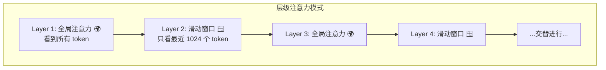

### 为什么要交替？

| 注意力类型 | 计算复杂度 | 能力 |
|:---|:---|:---|
| 全局注意力 | O(n²)，n 为序列长度 | 能捕捉任意距离的依赖关系 |
| 滑动窗口 | O(n × w)，w=1024 | 只关注局部上下文，计算量小 |

交替使用 = **用局部注意力处理大部分"就近参考"的场景，用全局注意力处理需要"远距离回忆"的场景**。

### GQA（分组查询注意力）

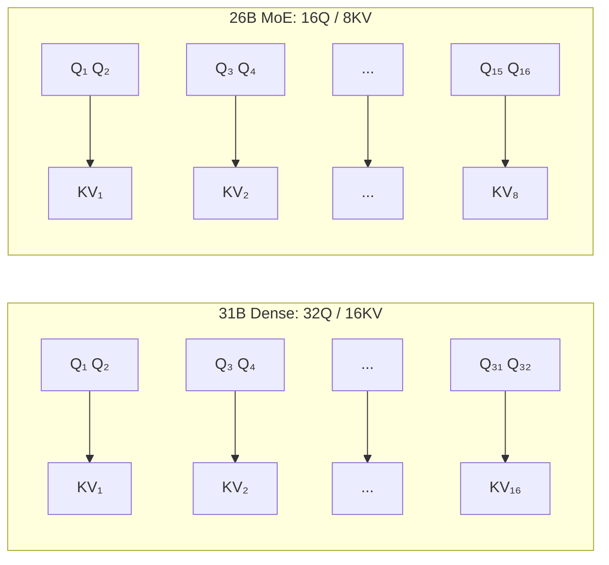

| | 31B Dense | 26B-A4B MoE |
|:---|:---|:---|
| Q 头数 | 32 | 16 |
| KV 头数 | 16 | 8 |
| head_dim | 128 | 256 |
| Q/KV 比 | 2:1 | 2:1 |
| 全局注意力 KV 头 | 16 | 2（`num_global_key_value_heads`） |
| 层数 | 60 | 30 |
| KV Cache 大小 | 大（60层×16KV头×128dim） | **小（30层×8KV头×256dim）** |

MoE 版本层数只有一半，且全局注意力层只有 5 层（全局 KV 头仅 2 个），KV Cache 显存占用远小于 Dense。

---

## 8. Per-Layer Embedding (PLE)

PLE（Per-Layer Embedding）是 Gemma 4 引入的新技术，提升参数效率。

### 传统方式 vs PLE

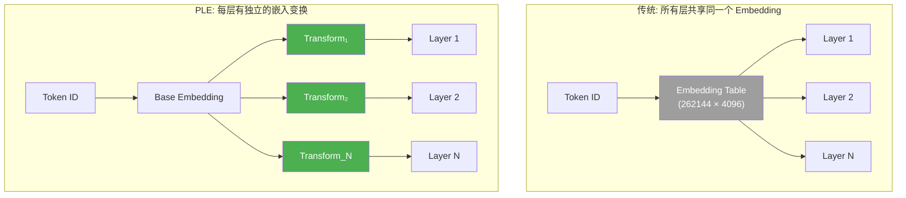

### 为什么 PLE 有效？

传统方式中，浅层和深层看到的是完全相同的输入表示。但实际上：
- **浅层**需要更多的表面特征（词形、语法）
- **深层**需要更多的语义特征（含义、逻辑）

PLE 让每一层都能对输入做一个轻量级的变换，使得不同深度的层看到"适合自己的"输入表示，提升了参数利用效率。

---

## 9. 视觉编码器

两个模型共享同一个视觉编码器 **SigLIP2**，约 550M 参数。

### 多模态处理流程

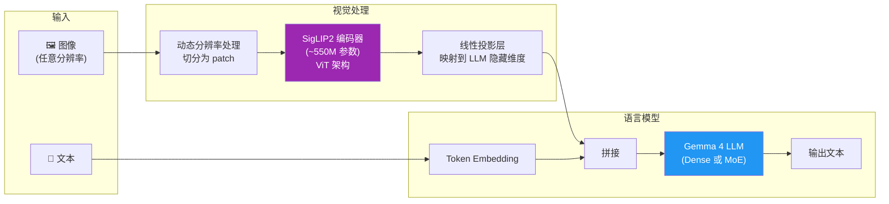

### 关键设计

| 特性 | 说明 |
|:---|:---|
| 可变分辨率 | 不强制缩放到固定尺寸，保留原始细节 |
| Pan & Scan | 智能裁剪策略，关注图像重要区域 |
| 软 Token 上限 | 控制视觉 token 数量，避免占用过多上下文 |
| 视频支持 | 将视频帧序列作为多张图像输入 |

---

## 10. 性能与效率对比

### 计算效率对比

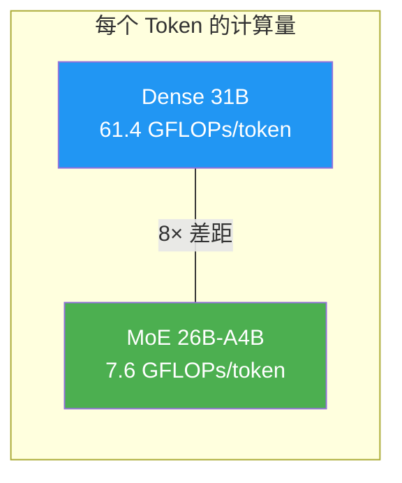

### 显存占用分析

| 组件 | 31B Dense | 26B-A4B MoE |
|:---|:---|:---|
| 模型权重 (BF16) | ~62 GB | ~48 GB |
| KV Cache (32K ctx) | ~15 GB (60层×16KV头) | ~4 GB (30层×6KV头) |
| 激活值 (推理) | ~2 GB | ~1 GB |
| **总计 (推理)** | **~79 GB** | **~53 GB** |

> 💡 MoE 虽然要加载全部 48GB 权重到显存（所有专家都要在），但 KV Cache 只有 Dense 的 1/4，因为层数减半 + KV 头更少。

### Benchmark 性能 vs 计算量

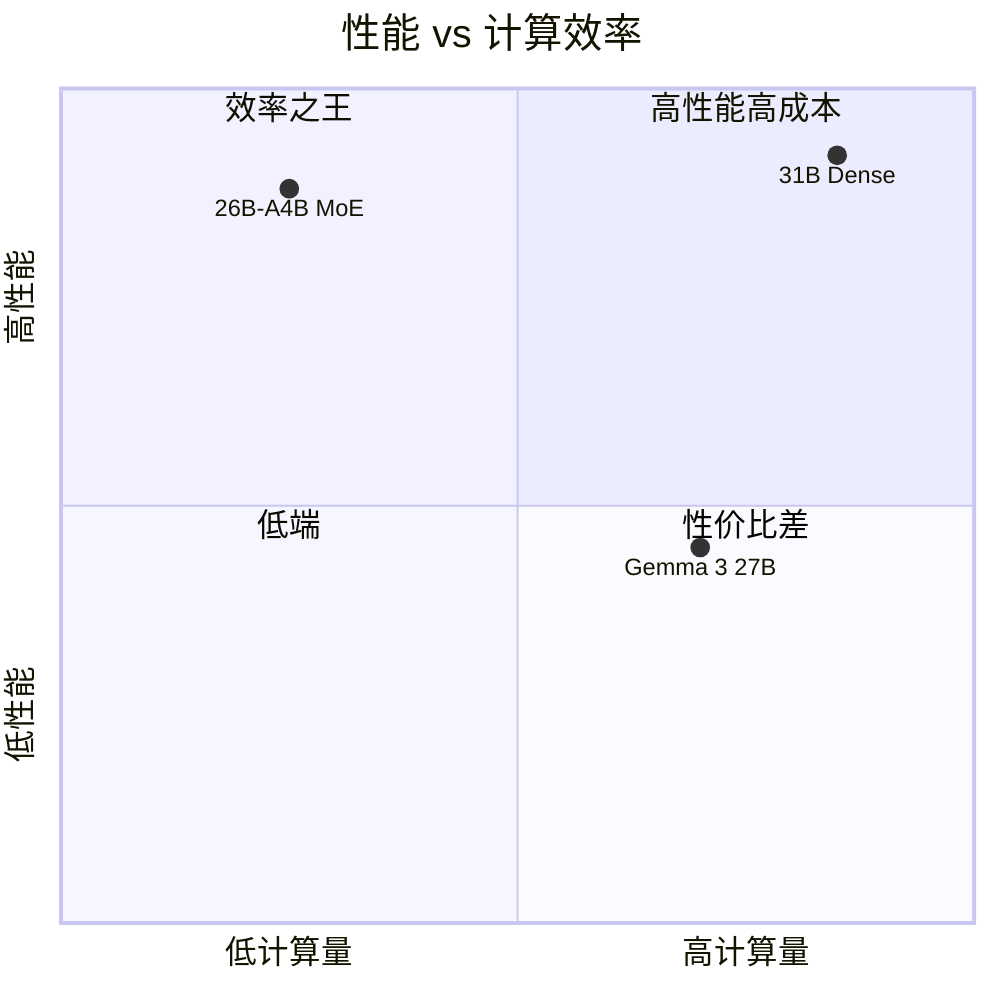

### 关键 Benchmark 对比

| Benchmark | 31B Dense | 26B-A4B MoE | MoE 达到 Dense 的 % |
|:---|:---|:---|:---|
| MMLU Pro | 85.2% | 82.6% | 96.9% |
| AIME 2026 | 89.2% | 88.3% | 99.0% |
| GPQA Diamond | 84.3% | 82.3% | 97.6% |
| LiveCodeBench v6 | 80.0% | 77.1% | 96.4% |
| Codeforces ELO | 2150 | 1718 | 79.9% |
| MRCR 128K | 66.4% | 44.1% | 66.4% |
| HLE | 19.5% | 8.7% | 44.6% |

**结论**：
- 常规任务（MMLU、AIME、GPQA）：MoE 达到 Dense **96-99%** 的性能，用 **1/8 的计算量**
- 极端任务（HLE、长上下文）：Dense 的深度优势（60层）明显体现，MoE 差距较大

---

## 11. 微调注意事项

### Dense vs MoE 微调策略差异

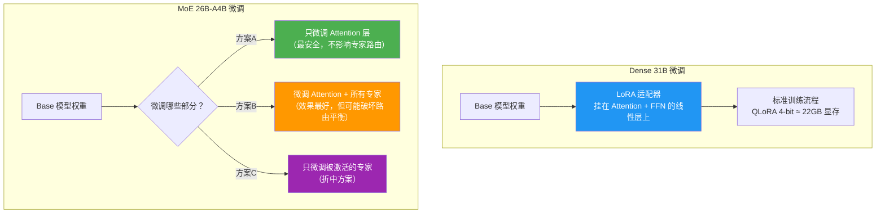

### LoRA 配置建议

| 配置项 | Dense 31B | MoE 26B-A4B |
|:---|:---|:---|
| target_modules | `q,k,v,o,gate,up,down_proj` | `q,k,v,o_proj`（保守）<br/>或加上专家层（激进） |
| rank (r) | 16~64 | 16~32 |
| lora_alpha | 2 × r | 2 × r |
| QLoRA 显存 | ~22 GB | ~16 GB |
| 训练注意事项 | 标准流程 | 注意 Router 冻结/解冻策略 |

### MoE 微调的特殊考量

1. **Router 一般冻结**：Router 的权重在预训练中已经学好了"分诊"能力，微调时通常不动它
2. **负载均衡**：如果微调数据分布和预训练差异大，可能导致某些专家过载
3. **专家冻结策略**：可以只微调最常被激活的 Top 专家，冻结其余的
4. **推荐工具**：Unsloth 对 MoE 微调有专门优化，自动处理上述问题

---

## 总结

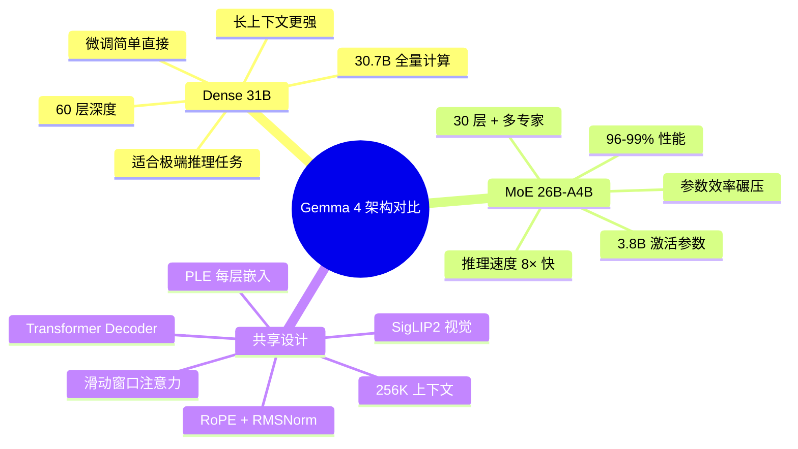

> **一句话总结**：Dense 31B 是"一个超强全能选手"，MoE 26B-A4B 是"一支高效的专家团队"。团队用 1/8 的工作量完成了 96% 的任务质量，但在需要极深思考的场景下，全能选手的 60 层深度优势不可替代。
